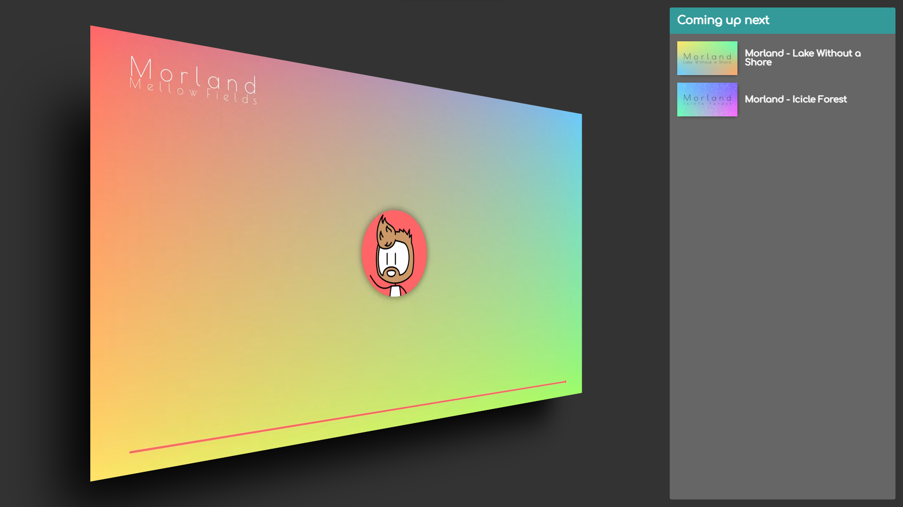
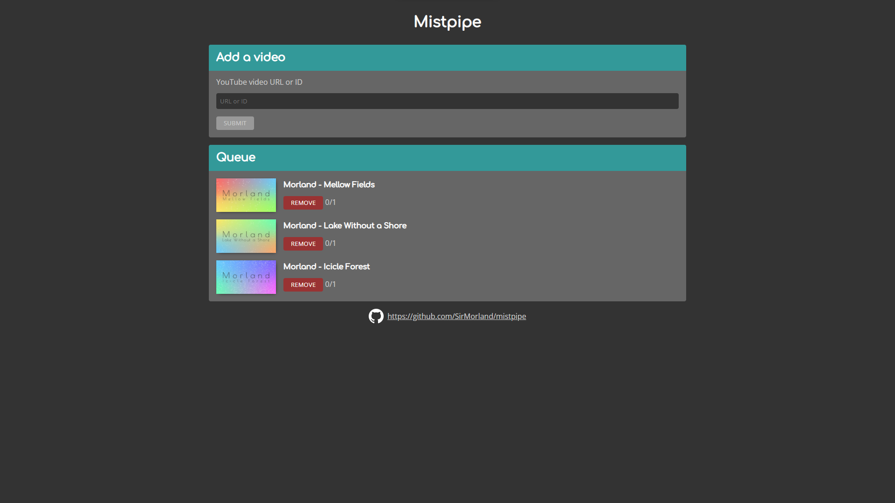

# Mistpipe
Multiuser YouTube playlist for LAN-parties

## Description
Mistpipe is a collaborative playlist of YouTube videos intended to be used on LAN-parties. A party host can share the videos being played on a big screen while participants (clients) can add videos to queue.

Mistpipe builds on the idea of Utuputki, see [/katajakasa/Utuputki2](https://github.com/katajakasa/Utuputki2) and [/turol/utuputki](https://github.com/turol/utuputki).

## Installation
1. Get YouTube API key from [Google Cloud Platform](https://console.cloud.google.com/)
1. Run `npm ci` both in **app** and **app/client** directories
1. Run `npm run build` in **app** directory
1. Run `docker-compose up -d` in root directory

## Host usage
On a computer connected to the big screen, navigate to [http://localhost:3000/mistpipe/watch](http://localhost:3000/mistpipe/watch) and click the Mistpipe logo to start playing videos in queue. Videos are played in full screen without visible YouTube controls. Between videos a short "Coming up next" banner is displayed. To set volume, hover the mouse on the left side of the screen and an overlay with volume controls appears.

## Client usage
Navigate to [http://localhost:3000/mistpipe](http://localhost:3000/mistpipe). You can add videos to queue by copying and pasting YouTube video links to the designated field. Both full and shortened URLs are supported. You can remove videos you added yourself from the queue by clicking the "Remove" button. You can vote to skip other people's videos by clicking the "Skip" button.

